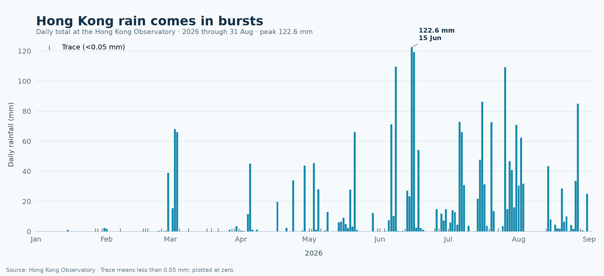

# Hong Kong rainfall arrives in bursts



## The phenomenon

Rainfall is uneven: long runs of dry days can sit beside a few very wet days. I wanted to see how that pattern looks over a year at one familiar Hong Kong measurement site. This project follows the daily total recorded at the Hong Kong Observatory station, rather than claiming to represent every district or an average across the territory. The current source file covers 1 January through 31 August 2026.

## The source

The data comes from the [Hong Kong Observatory's daily total rainfall CSV](https://data.weather.gov.hk/weatherAPI/cis/csvfile/HKO/2026/daily_HKO_RF_2026.csv), listed on [DATA.GOV.HK](https://data.gov.hk/en-data/dataset/hk-hko-rss-daily-total-rainfall). The committed file is `data/daily_HKO_RF_2026.csv`, the Observatory's published response, including its headings and notes. It contains 243 dated daily records in the snapshot used here; each row gives year, month, day, rainfall in millimetres, and a completeness code. The Observatory's `Trace` means less than 0.05 mm.

## What the picture shows

Each bar is one day's rainfall, so wet spells and individual downpours stand out against the dry-day baseline. The tallest bar is labelled with its date and amount. Trace observations are shown as small marks and treated as zero-height bars; that keeps their exact amount honest because the source only gives an upper bound, not a precise number. The chart ends at the last dated row in the file. It shows one station and one year-to-date snapshot, so it cannot describe rainfall differences across Hong Kong or establish a long-term climate trend.

## Run it

```text
uv run fetch.py
uv run plot.py
```
